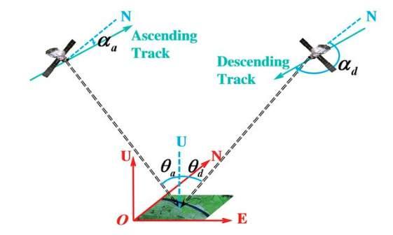

# **Glacier Tracking**  

## **Project Team**  
- Ayush Gupta ([@ayush12gupta](https://github.com/ayush12gupta)) 

## **Project Overview**  

This project aims to utilize NASA’s Observational Products for End-Users from Remote Sensing Analysis (OPERA) CSLC products for monitoring 3D glacier movements using feature tracking, as a time-series study of glacier change is essential to understand glacier dynamics for a region. We will also perform a brief analysis of variation in derived glacier velocities with seasons, terrain, and other climatic variables.

## **Introduction**  

Glacier surface movement are captured using feature tracking, which gives us how much surface corresponding to each pixel has moved from one time-step to another. Using SAR data for this purpose facilitates us to monitor 3D surface displacements because of its unique way of acquisition. 

  
*Figure: Geometric relationship between ascending and descending track products (Panfeng et al., 2020).*

## **Problem Statement & Objectives**  

The main objectives are to develop a tool for monitoring glacier surface movement, and understanding the variability and trends in glacier surface velocities. This project seeks to some answer the following questions for glaciers we observe:

* How has the glacier changed over past 6-7 years?
* How does the glacier surface velocity varies seasonally?
* How does the glacier velocities varies spatially with terrain?

## **Datasets**
- **[OPERA CSLC product](https://www.jpl.nasa.gov/go/opera/products/cslc-product-suite/)** – Coregistered Sentinel-1 SLC images.
- **[Randolph Glacier Inventory 7.0](https://www.glims.org/RGI/)** – Globally complete inventory of glacier outlines.  
- **[Copernicus 30m DEM (COP-DEM)](https://spacedata.copernicus.eu/web/cscda/dataset-details?articleId=394198)** – Global medium-resolution DEM.  
- OPERA CSLC product? Maybe

## **Tools & Software**  
We will leverage multiple tools to process and analyze the data:  
- **[autoRIFT](https://github.com/nasa-jpl/autoRIFT)** – Tool for dense feature tracking between two images over a grid defined in an arbitrary map-projected cartesian coordinate system.
- **[GeoPandas](https://geopandas.org/)** – Spatial data analysis.  
- **[Xarray](https://docs.xarray.dev/en/stable/)** – Handling multi-dimensional elevation datasets.  

## **Methodology**  
1. **Downloading OPERA Data** – Downloading all ascending and descending track SAR products for the selected time over a select time period.  
2. **Performing Feature Tracking** – Selecting all pairs of products within a certain temporal seperation and performing feature tracking to get velocities in azimuth and slant-range directions.
3. **Generating Time-series 3D velocity** – Combining offsets from ascending and descending tracks to obtain time-series of 3D glacier velocities.  
4. **Analysing resulting velocities** – Analyze spatial and temporal variations in glacier velocities.

## **Expected Outcomes**  
- Tool for performing **time-series analysis of fast moving surface deformations** using OPERA data. 
- Insights into movement of glaciers on Mt. Baker and Mt. Rainier.

## **References**   
- **Samsonov, S. (2021).** *Measuring the state and temporal evolution of glaciers in Alaska and Yukon using synthetic-aperture-radar-derived (SAR-derived) 3D time series of glacier surface flow, The Cryosphere.* [DOI](https://doi.org/10.5194/tc-15-4221-2021).
- **Lei, Y. (2021).** *Autonomous Repeat Image Feature Tracking (autoRIFT) and Its Application for Tracking Ice Displacement. Remote Sensing*. [DOI](https://doi.org/10.3390/rs13040749).

--- 