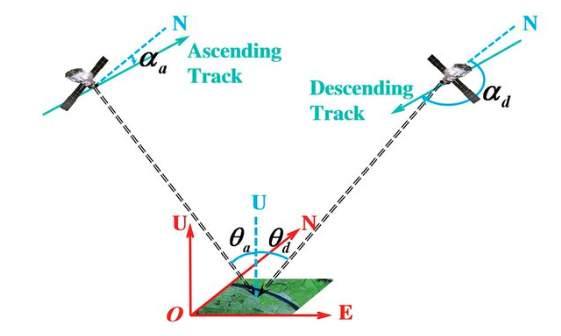
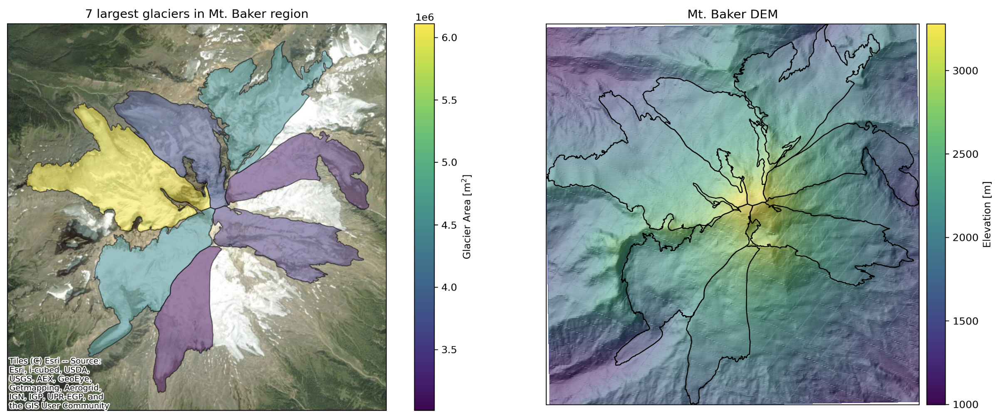
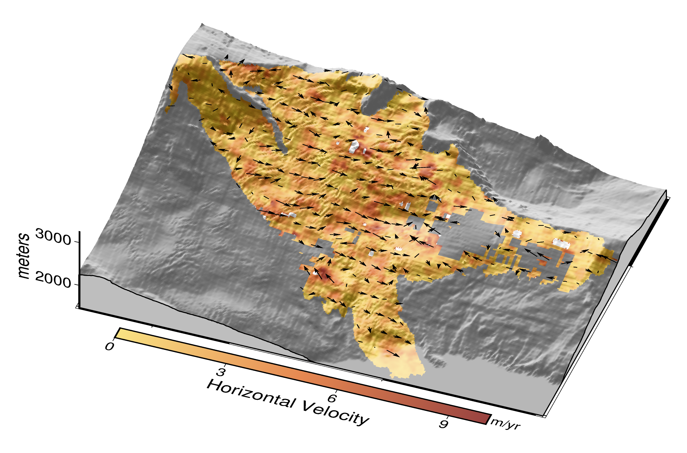
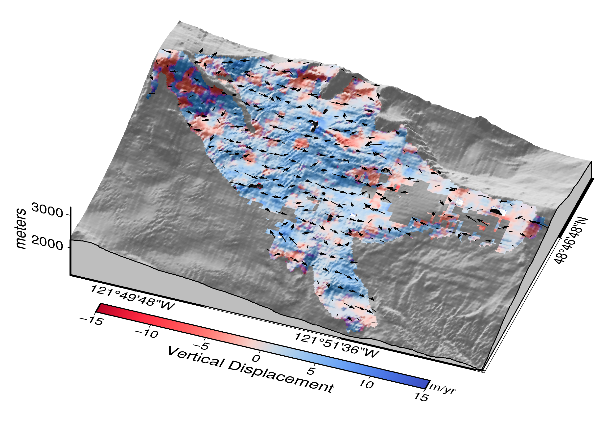

# **Glacier Tracking**  

## **Project Team**  
- Ayush Gupta ([@ayush12gupta](https://github.com/ayush12gupta)) 

## **Project Overview**  

This project aims to utilize NASA’s Observational Products for End-Users from Remote Sensing Analysis (OPERA) CSLC products for monitoring 3D glacier movements using feature tracking, as a time-series study of glacier change is essential to understand glacier dynamics for a region. We will also perform a brief analysis of variation in derived glacier velocities with seasons, terrain, and other climatic variables.

## **Introduction**  

Glacier surface movement are captured using feature tracking, which gives us how much surface corresponding to each pixel has moved from one time-step to another. Using SAR data for this purpose facilitates us to monitor 3D surface displacements because of its unique way of acquisition. 

  
*Figure: Geometric relationship between ascending and descending track products (Panfeng et al., 2020).*

## **Problem Statement & Objectives**  

The main objectives are to develop a tool for monitoring glacier surface movement, and understanding the variability and trends in glacier surface velocities. This project seeks to some answer the following questions for glaciers we observe:

* How has the glacier changed over past 6-7 years?
* How does the glacier surface velocity varies seasonally?
* How does the glacier velocities varies spatially with terrain?

## **Datasets**
- **[OPERA CSLC product](https://www.jpl.nasa.gov/go/opera/products/cslc-product-suite/)** – Coregistered Sentinel-1 SLC images.
- **[Randolph Glacier Inventory 7.0](https://www.glims.org/RGI/)** – Globally complete inventory of glacier outlines.  
- **[Copernicus 30m DEM (COP-DEM)](https://spacedata.copernicus.eu/web/cscda/dataset-details?articleId=394198)** – Global medium-resolution DEM.  
- OPERA CSLC product? Maybe

### Study Region

We will be monitoring the 7 largest glaciers present in Mt. Baker region. Glaciers on Mount Baker are temperate and maritime, shaped by heavy snowfall and a moist climate. They are mostly clean ice, with little debris cover, and respond quickly to seasonal changes. They are very different from valley type glaciers present in High Mountain Asia accumulating thick debris from surrounding steep terrain, thus making feature tracking easier. However it would be intereseting to observe how offset tracking performs on clean glaciers. 

*Figure: (left) 7 largest glaciers in Mt. Baker with their respective area; (right) elevation of the region.*

## **Tools & Software**  
We will leverage multiple tools to process and analyze the data:  
- **[autoRIFT](https://github.com/nasa-jpl/autoRIFT)** – Tool for dense feature tracking between two images over a grid defined in an arbitrary map-projected cartesian coordinate system.
- **[GeoPandas](https://geopandas.org/)** – Spatial data analysis.  
- **[Xarray](https://docs.xarray.dev/en/stable/)** – Handling multi-dimensional elevation datasets.  
- **[PyGMT](https://www.pygmt.org/latest/)** - Creating 3D visualisation of glacier flow directions with terrain.

## **Methodology**  
1. **Downloading OPERA Data** – Downloading all ascending and descending track SAR products for the selected time over a select time period.  
2. **Performing Feature Tracking** – Selecting all pairs of products within a certain temporal seperation and performing feature tracking to get velocities in azimuth and slant-range directions.
3. **Refining the time-series velocities** - We utilize SBAS for refining the glacier displacement along different directions, by utilizing multiple pairs of offsets. 
4. **Generating time-series 3D velocity** – Combining offsets from ascending and descending tracks to obtain time-series of 3D glacier velocities. 
5. **Analysing resulting velocities** – Analyze spatial and temporal variations in glacier velocities.

## **Project Workflow**

For running the pipeline from scratch we have provided the environment you would need as `requirement.txt` file. After that you just need to sequentially run the three jupyter notebooks in `notebooks`, consisting of:-

* **0_download_data.ipynb**: Containing the steps for downloading the OPERA data for your area of interest.

* **1_workflow_3d_velocity.ipynb**: This notebooks goes through all the steps involved for computing pair-wise offset estimated, to refining the time-series using SBAS and finally utilizing the refined time-series displacements to compute 3D glacier velocities.

* **2_analyse_resutls.ipynb**: This notebooks goes through some of the basic analysis we perfomed to understand spatial and temporal variations in glaciers velocities.

Moreover, we have provided some representative samples of the OPERA products used for our region in `data` directory. However we had to convert CSLC values to absolute values and change the file format from h5df to netCDF.

## **Results**  

We obtained a time-series of glacier velocities which were temporally seperated by 12 days. To analyse the temporal as well as spatial variations we computed their monthly mean as shown in both figures below.

*Figure: Montly mean horizontal velocities [m/yr] for glaciers in Mt. Baker region*

*Figure: Montly mean vertical velocities [m/yr] for glaciers in Mt. Baker region*

In the above figures we could observe that we have very high glacier velocities in months of November and December, which is not realistic as those are the month when snow is accumulating on glaciers. And usually glacier flow happens when snow/glaciers is melting and the meltwater from that makes the glaciers slide. We are most likely observations such erroneous observations for the months of November and Decemeber, as during those months a lot of snow accumulation takes place on those regions which hides all the features affecting the performance of feature tracking. Moreover, these glaciers are clean and don't have a lot of debris on them, thus we don't have much features to track when all the terrain of glaciers is covered by snow. Except those few winter months, we observe an increase in velocity for May, July and August, which is happening due to the melting that is happening during those Summer months.

To further understand the spatial variation in glacier velocity we plot a 3D visualisation of glacier velocity and their flow directions as shown in figures below.

*Figure: Horizontal velocity of Coleman glacier regions with flow directions*

*Figure: Vertical velocity of Coleman glacier regions with flow directions*

In both the figures above we can observe that flow directions look realistic, showing the movement of glaciers from higher elevation to lower elevations. Additionally, we can also observe negative vertical velocities in steep regions of terrain, moreover we observe higher horizontal velocities for those steep regions as well. This spatial variation is most likely due to higher higher force of gravity acting on those steep regions compared to more planar regions.

## **Conclusions**

* Velocities for november, december and january have a lot of noise, which might be due to dense snow cover on Mt. Baker.
    - Western US have wet snow which might be affecting the SAR backscatters.
* Vertical velocities are higher in steep regions.
* It is difficult to monitor clean glaciers using offset tracking.

## **Future work**

* Investigate further the reason for noisy data in winter months.
* Process data for a longer period of time to understand is seasonal variations are captured.
* Incorporate data from other sensors like optical data in the 3D velocity computation step.

## **References**   
- **Samsonov, S. (2021).** *Measuring the state and temporal evolution of glaciers in Alaska and Yukon using synthetic-aperture-radar-derived (SAR-derived) 3D time series of glacier surface flow, The Cryosphere.* [DOI](https://doi.org/10.5194/tc-15-4221-2021).
- **Lei, Y. (2021).** *Autonomous Repeat Image Feature Tracking (autoRIFT) and Its Application for Tracking Ice Displacement. Remote Sensing*. [DOI](https://doi.org/10.3390/rs13040749).

--- 